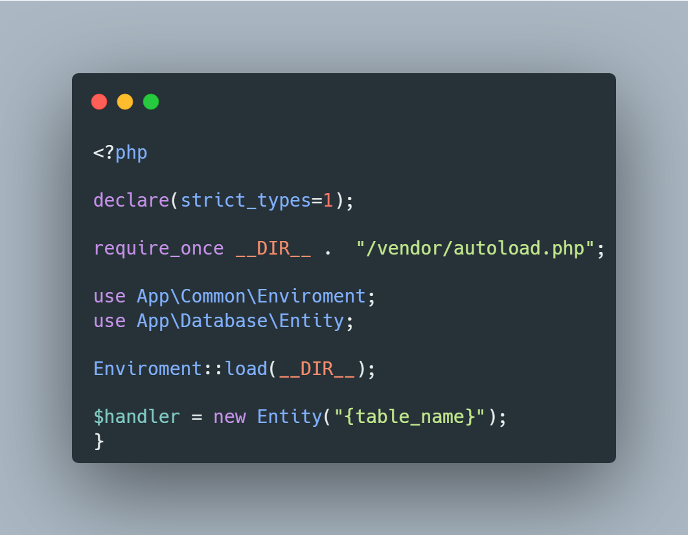
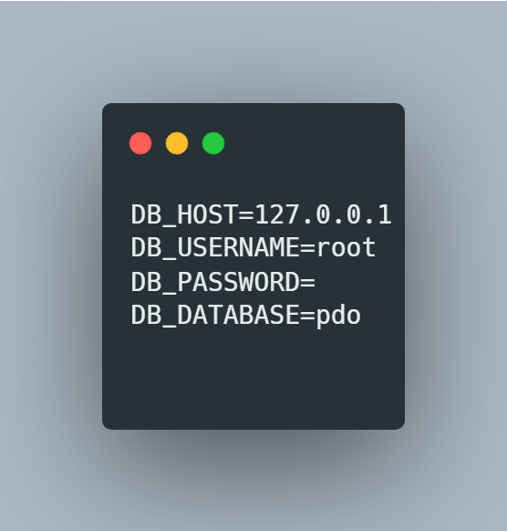

# OOP CRUD
CRUD operations performed with the object-oriented programming paradigm in order to challenge my knowledge

## Technologies
- PHP
- MySQL

## How to use
Instantiate the class entity and pass the name of the table you want to handle in its constructor. The database connection settings (such as username, database, host, etc.) can be modified in a file called .env in the root directory

### Index.php

### Enviroment File

### Entity Class

